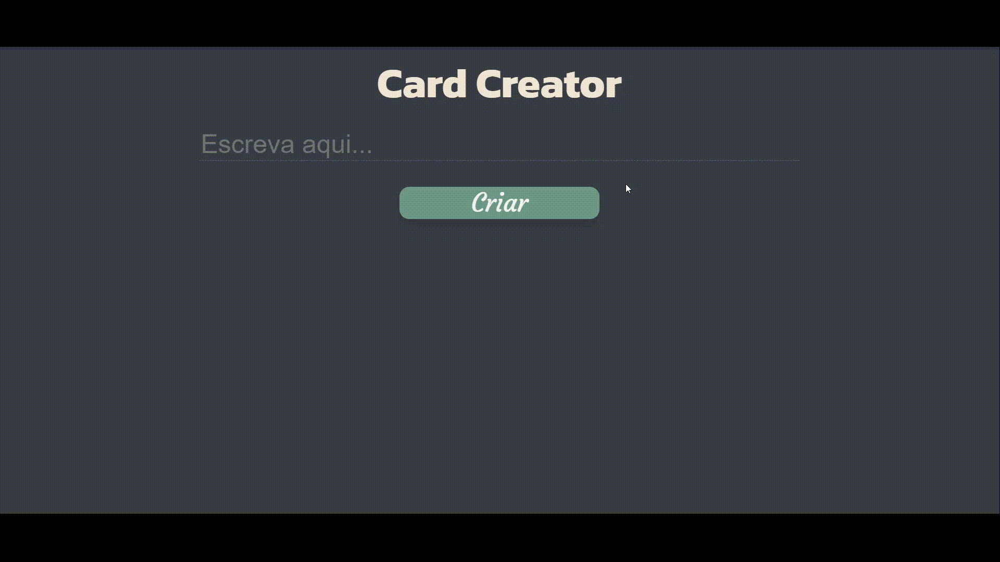

<h1 align="center"> Card Creator - Theilor Stolfi</h1>

  <a href="#-tecnologias">Tecnologias</a>&nbsp;&nbsp;&nbsp;|&nbsp;&nbsp;&nbsp;
  <a href="#-projeto">Projeto</a>&nbsp;&nbsp;&nbsp;|&nbsp;&nbsp;&nbsp;
  <a href="#-layout">Layout</a>&nbsp;&nbsp;&nbsp;|&nbsp;&nbsp;&nbsp;

  

## 🚀 Tecnologias

Esse projeto foi desenvolvido com as seguintes tecnologias:

- HTML
- CSS
- JavaScript

## 💻 Projeto

Card Creator é um projeto simples de criação de anotações em cards.
Ele armazena o que o usuário digitou na caixa de input e cria um card com a mesma frase, sendo também possível excluí-lo depois de criado.

## 🔖 Layout

O layout do projeto foi projetado e criado por Theilor Stolfi.